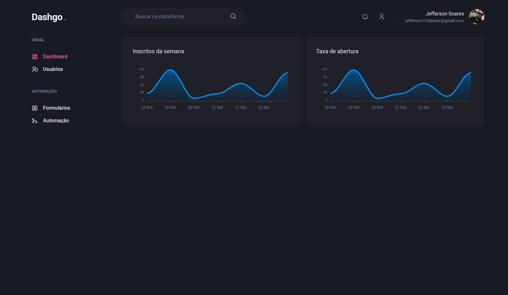
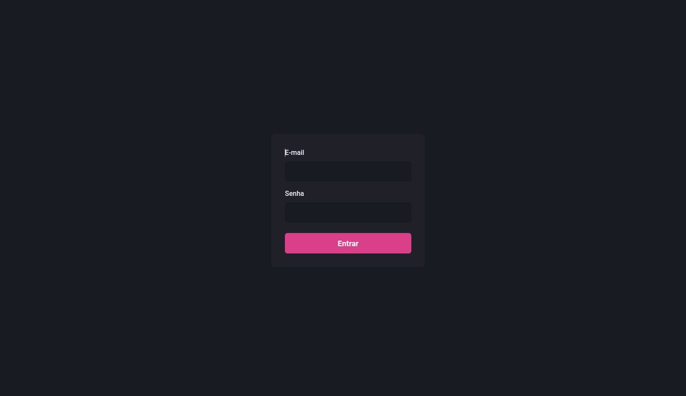
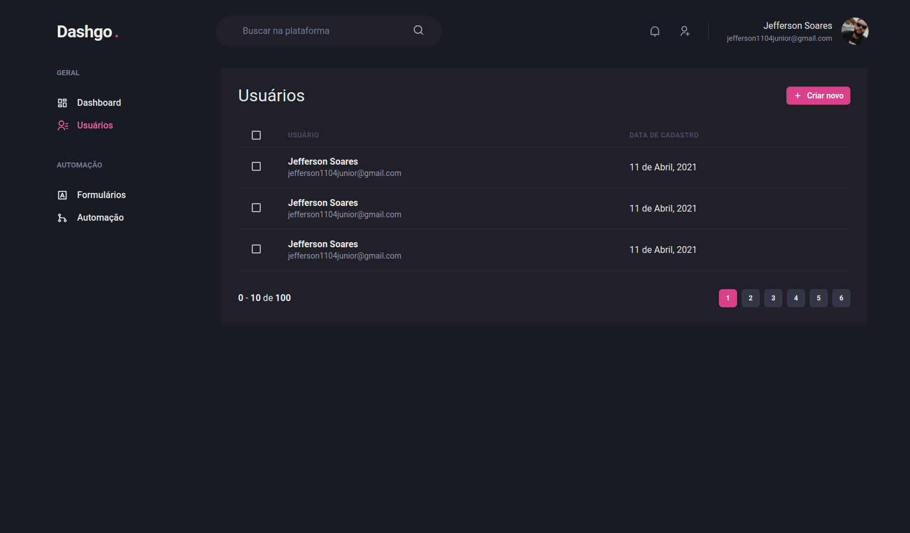
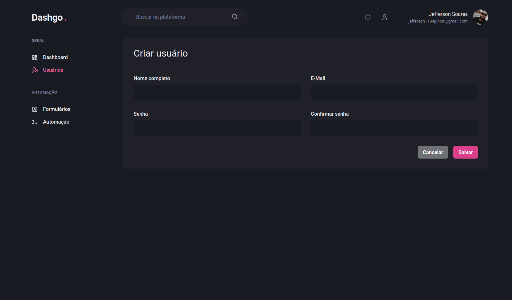

<h1 align="center">
  DASHGO.
</h1>

<p align="center">
  

  

  
</p>

<p align="center">
  
</p>

## 💻 Sobre o projeto

Utilizando o Typescript e Next.js criei uma dashboard onde seu design foi totalmente desenvolvido utilizando o **Chakra-UI**, nesse exemplo de app podemos ver diversas técnicas de utilização do Chakra-UI e tambem a sua integração de formulários utilizando o React Hook Forms e a validação de campos com o Yup.

## :hammer: Tecnologias

Este projeto foi desenvolvido com as seguintes Ferramentas:

- **[TypeScript](https://www.typescriptlang.org/)**
- **[Next.js](https://nextjs.org/)**
- **[FaunaDB](https://fauna.com/)**
- **[Chakra-UI](https://chakra-ui.com/)**
- **[React Hook Forms](https://react-hook-form.com/)**
- **[Yup](https://github.com/jquense/yup)**

## 🚀 Executar o projeto

```bash
# Clone o repositório
$ git clone https://github.com/jefferson1104/dashgo-nextjs.git

# Execute o projeto
$ yarn dev
```

## 🎨 Screenshots





